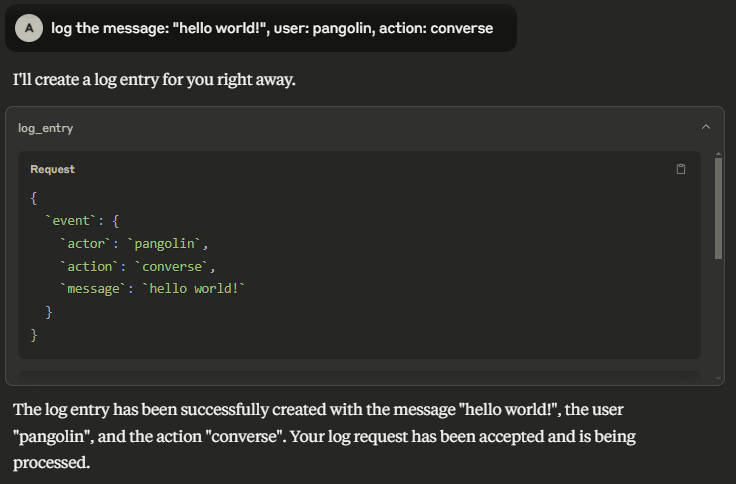

# Pangea MCP Server

A [Model Context Protocol (MCP)](https://modelcontextprotocol.io/introduction)
server that provides integration with Pangea APIs.



## Prerequisites

- Node.js v22.15.0 or greater.
- A Pangea API token with access to all of AI Guard, Domain Intel, Embargo,
  IP Intel, Redact, Secure Audit Log, and URL Intel. This token needs to be
  stored in Pangea Vault. See [Service Tokens][] for documentation on how to
  create and manage Pangea API tokens.
- A Pangea API token with access to Vault. This will be used to fetch the above
  token at runtime.
- A Pangea Secure Audit Log configuration with the "Standard Audit Log Config"
  [schema][Audit Schema]. See [Multiple Service Configurations][] for
  documentation on how to create a new Secure Audit Log configuration. Note down
  the configuration ID for later.

The first API token may look like:


## Installation

First build the project from source:

```shell
$ git clone https://github.com/pangeacyber/pangea-mcp-server.git
$ cd pangea-mcp-server
$ npm install
$ npm run build
```

Then configure a MCP client like Claude Desktop or VS Code to run the server.

### Usage with Claude Desktop

Edit the following configuration file (create it if it does not exist):

- macOS: `~/Library/Application Support/Claude/claude_desktop_config.json`
- Windows: `%APPDATA%\Claude\claude_desktop_config.json`

Replace (or merge) the file contents with the following:

```json
{
  "mcpServers": {
    "pangea": {
      "command": "node",
      "args": ["/path/to/pangea-mcp-server/dist/index.js"],
      "env": {
        "PANGEA_VAULT_TOKEN": "pts_00000000000000000000000000000000",
        "PANGEA_VAULT_ITEM_ID": "pvi_00000000000000000000000000000000",
        "PANGEA_AUDIT_CONFIG_ID": "pci_00000000000000000000000000000000"
      }
    }
  }
}
```

1. Update the `/path/to/` path to point to the location of the Pangea MCP
   server.
2. Update the `PANGEA_VAULT_TOKEN` value to the Pangea Vault API token.
3. Update the `PANGEA_VAULT_ITEM_ID` value to the Vault item ID that contains
   the API token that will be used to call all other Pangea services.
4. Update the `PANGEA_AUDIT_CONFIG_ID` value to the Secure Audit Log
   configuration ID.
5. Restart Claude Desktop.

## Tools

### AI Guard

- **prompt_guard** — Analyze and redact text to avoid manipulation of the model, addition of malicious content, and other undesirable data transfers.

### Domain Intel

- **lookup_domain_reputation** — Look up reputation score(s) for one or more domains.
- **whois** — Retrieve WHOIS (an Internet resource's registered users or assignees) for a domain.

### Embargo

- **check_ip_embargo** — Check one or more IP addresses against known sanction and trade embargo lists.
- **check_iso_code_embargo** — Check a country code against known sanction and trade embargo lists.

### File Intel

- **lookup_file_reputation** — Retrieve a reputation score for a set of file hashes.

### IP Intel

- **lookup_ip_address_reputation** — Look up reputation score(s) for one or more IP addresses.
- **lookup_domain_from_ip_address** — Retrieve the domain name associated with one or more IP addresses.
- **is_proxy** — Determine if one or more IP addresses originate from a proxy.
- **is_vpn** — Determine if one or more IP addresses originate from a VPN.
- **geolocate** — Geolocate, or retrieve location information associated with, one or more IP addresses.

### Redact

- **redact** — Redact sensitive information from provided text.

### Secure Audit Log

- **log_entry** — Create a log entry in the Secure Audit Log.
- **search_log** — Search the Secure Audit Log.

### URL Intel

- **lookup_url_reputation** — Look up reputation score(s) for one or more URLs.

[Service Tokens]: https://pangea.cloud/docs/admin-guide/projects/credentials#service-tokens
[Audit Schema]: https://pangea.cloud/docs/audit/getting-started/configuration#audit-schema
[Multiple Service Configurations]: https://pangea.cloud/docs/audit/getting-started/multiple-configurations
