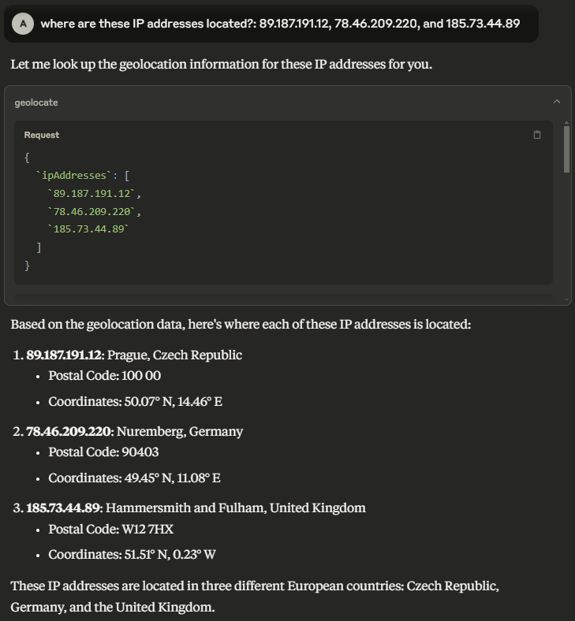

# Pangea MCP Server

A [Model Context Protocol (MCP)](https://modelcontextprotocol.io/introduction)
server that provides integration with Pangea APIs.



## Prerequisites

- Node.js v22.15.0 or greater.
- A Pangea API token with access to all of AI Guard, Domain Intel, Embargo,
  IP Intel, Prompt Guard, Redact, Secure Audit Log, and URL Intel. This token
  needs to be stored in Pangea Vault.
- A Pangea API token with access to Vault. This will be used to fetch the above
  token at runtime.
- A Pangea Secure Audit Log config with the "Standard Audit Log Config" schema.

## Installation

First build the project from source:

```shell
$ git clone https://github.com/pangeacyber/pangea-mcp-server.git
$ cd pangea-mcp-server
$ npm install
```

Then configure a MCP client like Claude Desktop or VS Code to run the server.

### Usage with Claude Desktop

Edit the following configuration file (create it if it does not exist):

- macOS: `~/Library/Application Support/Claude/claude_desktop_config.json`
- Windows: `%APPDATA%\Claude\claude_desktop_config.json`

Replace (or merge) the file contents with the following, updating the path and
the environment variables. `PANGEA_VAULT_TOKEN` should be the Pangea Vault API
token, and `PANGEA_VAULT_ITEM_ID` should be the Vault item ID that contains the
API token that will be used to call all other Pangea services.

```json
{
  "mcpServers": {
    "pangea": {
      "command": "node",
      "args": ["/path/to/pangea-mcp-server/dist/index.js"],
      "env": {
        "PANGEA_VAULT_TOKEN": "pts_00000000000000000000000000000000",
        "PANGEA_VAULT_ITEM_ID": "pvi_00000000000000000000000000000000",
        "PANGEA_AUDIT_CONFIG_ID": "pci_00000000000000000000000000000000"
      }
    }
  }
}
```

Then restart Claude Desktop.

## Tools

### AI Guard

- **guard_text** — Analyze and redact text to avoid manipulation of the model, addition of malicious content, and other undesirable data transfers.

### Domain Intel

- **lookup_domain_reputation** — Look up reputation score(s) for one or more domains.
- **whois** — Retrieve WHOIS (an Internet resource's registered users or assignees) for a domain.

### Embargo

- **check_ip_embargo** — Check one or more IP addresses against known sanction and trade embargo lists.
- **check_iso_code_embargo** — Check a country code against known sanction and trade embargo lists.

### File Intel

- **lookup_file_reputation** — Retrieve a reputation score for a set of file hashes.

### IP Intel

- **lookup_ip_address_reputation** — Look up reputation score(s) for one or more IP addresses.
- **lookup_domain_from_ip_address** — Retrieve the domain name associated with one or more IP addresses.
- **is_proxy** — Determine if one or more IP addresses originate from a proxy.
- **is_vpn** — Determine if one or more IP addresses originate from a VPN.
- **geolocate** — Geolocate, or retrieve location information associated with, one or more IP addresses.

### Prompt Guard

- **prompt_guard** — Detect malicious prompts including direct or indirect prompt injection attacks and jailbreak attempts.

### Redact

- **redact** — Redact sensitive information from provided text.

### Secure Audit Log

- **log_entry** — Create a log entry in the Secure Audit Log.
- **search_log** — Search the Secure Audit Log.

### URL Intel

- **lookup_url_reputation** — Look up reputation score(s) for one or more URLs.
